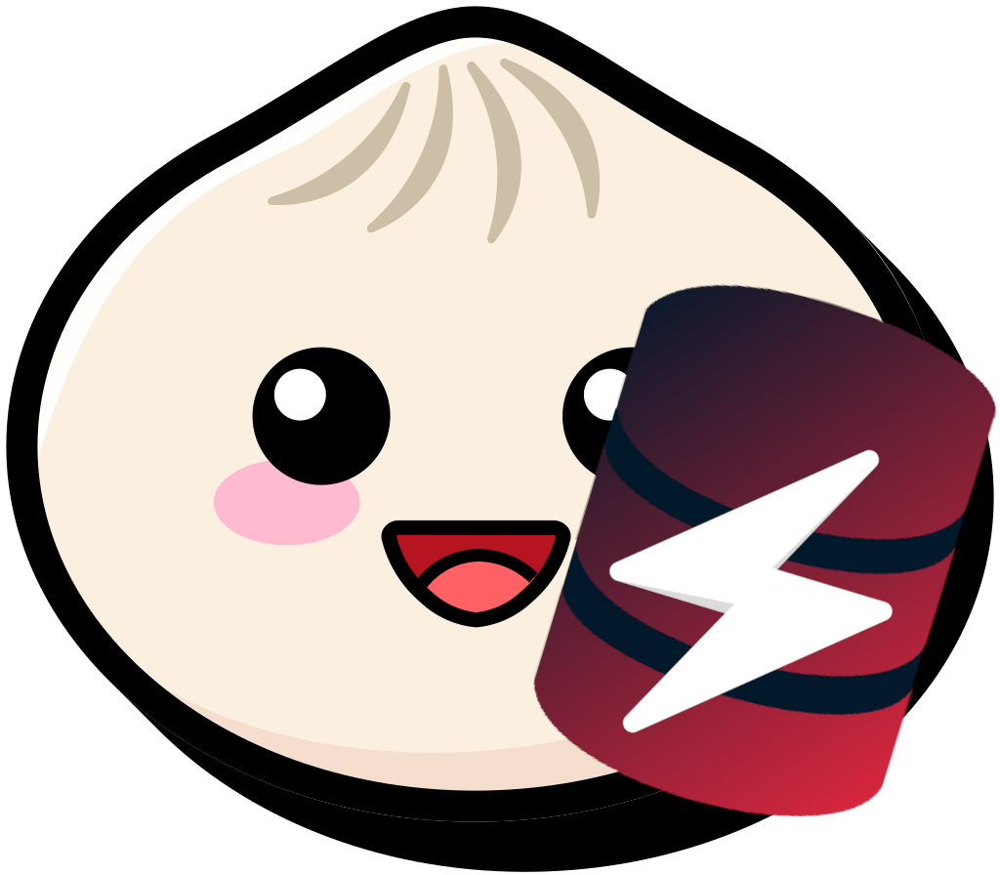

# Zeonic
ZeonDB SDK for the Bun.js runtime



## Usage
### Getting `libZeonCAPI.so`
```sh
git clone https://codeberg.org/LowByteFox/ZeonDB.git
cd ZeonDB
cmake -B build -G Ninja # Make sure you have all dependencies installed
ninja -C build ZeonCAPI_Shared # After it is done you can find the lib as build/libZeonCAPI.so
```
```ts
import { initZeonDB, ZeonDB, Key } from "zeonic";
/* It is not ready yet to be on npm
 * I had to be quick with this so for now just get the `index.ts` file
 * and import stuff from that
 */


initZeonDB("libZeonCAPI.so"); // you must run this!

const db = new ZeonDB("127.0.0.1", 6748);

if (await db.login("user", "pass")) {
    await db.set(Key("hello"), "world");

    let res = await db.get(Key("hello"));
    if (res.ok) {
        console.log(res.value);
    } else {
        throw new Error(err.msg);
    }
} else {
    throw new Error(await db.get_error());
}

await db.disconnect();
```

## Documentation
> TODO <br>
> For now look into `test.ts`
